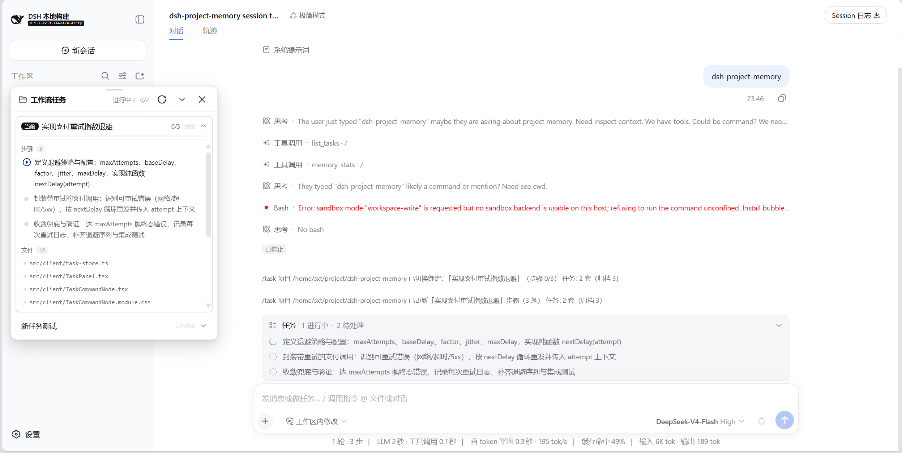
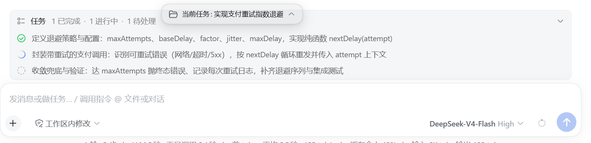

# dsh-project-memory

> 如果这个插件帮你省下 1 小时 Debug 时间，请点个 Star。

[English](README.md) | [简体中文](README.zh-CN.md)

[](https://github.com/00080000/dsh-project-memory/actions/workflows/ci.yml) [](LICENSE) [](https://www.npmjs.com/package/@yolk_vat-y/dsh-project-memory) [](https://www.npmjs.com/package/@yolk_vat-y/dsh-project-memory) [](https://dsh-plugin.org/plugins/00080000/dsh-project-memory) [](https://awesome-dsh-plugin.com)


A persistent **project development memory** for [DeepSeek Harness](https://github.com/deepseek-ai/deepseek-harness) (dsh) agents. Built specifically for project development, natively integrated with dsh's task system: task lists and files read during a session are automatically persisted as cross-session task records, with tasks ↔ files linked — workflows can be switched and resumed, no need to re-scope the whole project, solving context loss. Documents (PDF/Markdown/txt) and code symbols are stored separately per workspace; documents are automatically cross-linked to the code symbols they mention. Experience notes (problem → solution) are automatically deduplicated, preventing repeated mistakes. All data is stored per project on disk, survives session compaction and handover; recalls include `path:line` citations for source verification. Only one dependency, no vector DB, no native builds.

> The plugin keeps a compact project **memory** on disk, with every entry pointing to a concrete file and line — the agent can reorient quickly instead of re-reading the whole project.



## Features

- **TaskBridge: cross-session development tasks** — the session's todo list and the files it touches are persisted as per-project task entities, so a workflow can be switched and resumed without re-scoping the project. Associated files stay in recency-weighted order (a read never outranks a written file), so a resumed session sees where to look first. New sessions continue with `list_tasks` → `select_task`. Work delegated to subagents creates no task. On hosts without session events the task tools still work as a plain record list.
- **Task panel and editing** — draggable cards show a task's steps and files, and can collapse to a mini-bar or be hidden. Title, steps and status can be edited inline, writing back through the same path as model updates; four visual themes change material, geometry, typeface and density only, and colours follow the host. The panel stays hidden until summoned, syncs in the background on session switch, never reopens itself after a refresh, and a render failure cannot take down the host.
- **Document memory** — PDF, Markdown and plain text are chunked and summarized without a model call. Each entry keeps a short summary for injection, a bounded term set for recall, and a citation back to the source.
- **Code symbol memory** — a dependency-free scanner extracts functions, classes, methods, interfaces and type aliases with full signatures across 8 languages. Where `typescript` is installed, an optional second layer adds inferred return types, generics and interface shapes; it runs in the background and never blocks indexing.
- **Automatic, read-time memorization** — a file is memorized the moment the model reads it, so memory is a byproduct of normal work rather than an upfront scan, and files nobody reads are never indexed. A background poll re-memorizes changed files only.
- **Doc ↔ code cross-linking** — a document that mentions a symbol is surfaced when that symbol is queried. Links are resolved against the current symbol table, so they cannot go stale.
- **BM25 recall** — ranked search over documents, symbols, experience notes and insights, with optional LLM query expansion. Tuned for CJK: phrase boost, a synonym table, and CJK-aware boundaries for doc↔symbol linking.
- **Experience notes** — problems → solutions, deduplicated by overlap rather than repeated, bounded by project size, and returned only when a search matches.
- **Tiered insight memory (lessons / decisions / procedures)** — one entity across task, project and global scope. Near-duplicates merge or reinforce, and promotion moves an entry between scopes instead of copying it. Use is recorded, so decay and capacity rank by activity rather than age alone. The panel exposes a per-scope view for reviewing and editing entries.
- **Triggered injection** — an insight may carry an authored trigger: only `when` triggers, `guard` narrows it, and `prevents` records what breaks without the entry. Corpus text can never trigger an injection; the statistical channel is gated separately and silent by default.

## Installation

The plugin relies only on stable public APIs declared through peerDependencies.

```bash
cd dsh-project-memory && dsh plugin --profile web add . -w
```

The `-w` (workspace-root) flag is required: the profile directory is a pnpm workspace root, and pnpm rejects `add` there without it. From elsewhere, use the same command with an absolute path.

The plugin is also published on npm as a scoped package:

```bash
dsh plugin --profile web add @yolk_vat-y/dsh-project-memory -w
```

Each indexed project has its own store at `<root>/.dsh-project-memory/`. It keeps itself out of git by default — there is nothing to add to your `.gitignore`.

## Usage

The tools below are **invoked by the agent**, not typed by the user. In the chat, just ask naturally — e.g. "index this project" or "what does the auth module do?" — or simply keep working, and the agent calls the matching tool automatically. By default files are indexed the moment the model reads them, so memory fills in while you work. `watch_repo` keeps explicitly-watched roots fresh in the background; `index_repo` forces a full backfill (unchanged files are skipped).

| Tool | Purpose |
|---|---|
| `index_doc file_path` | Index one document (PDF/MD/txt): chunk, summarize deterministically, and store with a `path:line` citation. Unchanged files are skipped. |
| `index_repo root` | Index a whole project: documents get deterministic summaries, code files get a token-free symbol table. Incremental, cleans up deleted files, cross-links documents to symbols. A non-existent or excluded root is rejected before anything is written. |
| `watch_repo root` | Enable automatic refresh: a background poll detects new and changed files and re-indexes only those. Watched roots persist across restarts; a non-existent or excluded root is refused, roots that disappear are dropped rather than re-created. |
| `memory_stats root` | Show what the store contains: totals, last index time, and the per-file list sorted by recency. |
| `query_memory query` | Ranked search over documents, symbols, experience and insights, optionally query-expanded by the LLM. `type` selects a layer (`all` / `doc` / `symbol` / `experience` / `insight` / `task`). Returns hits with relative scores, sources or insight ids, and doc→symbol references. |
| `list_tasks` | List task records for the project (archived marked). Call first in a new session before continuing work. |
| `select_task` | Bind the session to a task so its todo list and file reads sync into it. Exact `taskId`, or exact `title` (multiple matches return candidates; no match creates a new task). Pass `title` with `taskId` to rename. Auto-unarchives. |
| `archive_task` | Archive a task (hide from default views, exclude from capacity, stop syncing). `select_task` restores it. |
| `show_task_panel` | Show the task panel in the UI. Call when the user asks to see the task list or when you want to display the panel. |
| `/tasks` (typed by the user, not the model) | The only user command: shows the task stack and drives the workflow card. Every other action is a **sub-verb** invoked by card buttons: `switch` / `archive` / `unbind` / `rename` / `todos …` for tasks, `insight list` / `confirm` / `promote` / `demote` / `archive` / `restore` / `delete` / `save` / `edit` for memory. |
| `remember problem solution` | Save an experience note. Similar problems supersede instead of duplicating. |
| `forget id_or_query` | Delete stale experience notes. |
| `save_lesson` | Save a lesson / decision / procedure at task, project or global scope. Near-duplicates merge (≥ 0.7 overlap) or reinforce (0.65–0.7); two tasks hitting the same insight promote it task → project, three or more → global. Key params: `title`, `kind`, `scope`, the content (`pattern`/`fix`, `choice`/`reason` or `steps`), and `trigger` (`when` is the only trigger surface, `guard` narrows it, `prevents` records what breaks without it). |

`/tasks` appears in the web `/` menu inside an icon-bearing **Workflow** group, with three view entries — Tasks / Project Memory / Global Memory (labelled in the UI language). It is the plugin's only registered command; every other action rides it as a sub-verb driven by card buttons.

## How it works

The design follows four principles:

- **Volatility** — context is ephemeral; it is lost when a session is compacted.
- **Persistence** — the **memory** is stored on disk and survives compaction and new sessions.
- **Compactness** — one bounded declaration line per symbol, and a ≤300-char summary plus a bounded term set per document chunk. Derived data is never stored: doc→symbol links are computed at read time. Index size depends on symbol density and chunk length, so treat these as measurements of specific corpora (2026-09-25), not guarantees: a code-only Vue app (289 files) lands at **325 bytes/entry ≈ 21% of source**, a symbol-dense TypeScript monorepo (12,408 files / 106 MB of code + 14 MB of docs) at **22% of source for the code layer (553 bytes/entry overall)** and **130% for the document layer**, and a 274-document workspace (PDFs and Markdown) at **1,506 bytes/entry**.
- **Verifiability** — **recalls** carry a `path:line` citation where applicable, so the agent can confirm details against the source.

Building the **memory** does not require an upfront scan: files are memorized as the model reads them, so the **memory** grows to cover exactly what has been worked with. Re-reading an unchanged file is a no-op, so the **memory** stays fresh with minimal ongoing overhead.

The store is per-project and follows the codebase: changed files are re-extracted by content hash, deleted files are removed. Experience notes are retrieval-only, so accumulation does not affect context.

## Design

```
.dsh-project-memory/
  format.json      layout marker (v2, sharded)
  shards/          one self-describing JSON per indexed source file — writes touch only dirty shards
  experience.json  problem → solution notes (retrieval-only)
  watch.json       watched roots
  tasks.json       TaskBridge task entities (cross-session)
  binding.json     current session ↔ task binding
  insights.json    project-scope insights (lessons / decisions / procedures)
  injection-audit.jsonl   one line per real injection (what / why / dropped / budget)
  admission-shadow.jsonl  one line per step, all scored candidates + features (offline replay)
```

Stores created before v0.2.0 migrate automatically and idempotently on first load. Within one dsh process, all tool calls share a single in-memory store per project, so hot-path indexing writes only the shard that changed.

- **Incremental** — a content hash per file; only changed files are re-extracted.
- **Cross-linking** — a returned document chunk resolves the symbols it mentions against the **current** symbol table and appends them as `references`, so a doc indexed before its symbols still links correctly.
- **Query expansion** — when enabled, `query_memory` asks the LLM to rewrite the query into several variants (synonyms, EN/CN, identifier guesses) and merges the scores; when off, queries never touch the LLM. Indexing itself is model-free.
- **Consistency** — the fact layer follows the codebase (hash re-extract / remove-on-delete); the experience layer is retrieval-only with supersede and `forget`. The store lock is in-process, so avoid running multiple dsh instances against the same project store.

## Architecture (Task Panel)

```
TaskPanel (Container)
├── task-data-store  (server data, cross-tab sync via BroadcastChannel)
├── task-ui-store    (local UI state, localStorage)
├── task-hooks       (useTaskDrag, useTaskEdit)
└── TaskComponents   (MiniBar, TaskCard — presentational only)
```

The workflow panel is collapsible, adapts to dsh and theme plugin styles, and offers four card styles.

The client half declares **no top-level `inject`**: cordis gates `apply()` on that declaration, so one unavailable service silently removes the whole plugin (no panel, no `/` group, no error). The five services it needs — `slots`, `sessions`, `remote`, `remote.commands`, `locale` — are therefore probed at runtime: the plugin always mounts, the panel header names whatever is missing, and one `console.warn` names it after a 3 s grace period.



## Configuration

| Key | Default | Meaning |
|---|---|---|
| `memoryDir` | `.dsh-project-memory` | store directory inside each indexed root |
| `chunkChars` / `maxChunksPerFile` | 3000 / 40 | max chars per document chunk, max chunks per document |
| `maxFileSizeMb` | 10 | skip documents (incl. PDF) and code files larger than this (MB); see the per-file memory budget below |
| `maxPdfPages` | 1000 | PDF page cap |
| `maxOutputChars` | 8000 | cap for `query_memory` result text (chars) |
| `lazyIndexing` | true | index files the moment the model reads them |
| `autoIndexOnFirstUse` | false | full scan of the current working directory on plugin load (opt-in) |
| `watch` / `watchInterval` | true / 30 | background refresh; base poll interval in seconds (polls stay quiet while a turn is running — a 5-minute fallback keeps external edits fresh — and one merged scan runs at turn end; idle polls back off up to 2 minutes and reset on any change) |
| `maxScanFiles` / `maxScanDepth` | 20000 / 12 | per-scan caps on files and directory depth; a truncated pass is reported and never removes what it did not reach. Set `0` to disable |
| `allowUnsafeRoots` | false | allow **explicit** tool calls to target a directory on the excluded list. Automatic paths (lazy indexing, session audit, TaskBridge, `autoIndexOnFirstUse`) stay inert there regardless |
| `llmQueryExpansion` / `expansionCount` | false / 6 | expand queries via the LLM before search (off by default to save tokens); max variants |
| `tsPath` / `enableTypeScript` | (auto) / true | optional absolute path to a specific `typescript` install; set `enableTypeScript: false` to disable the type-aware layer entirely |
| `tasklist.enabled` / `tasklist.syncHostOnAdopt` | true / true | TaskBridge auto-sync (task entities from the session todo list and file reads); push a bound task's steps to the host task list so dsh mirrors it |
| `insight.*` | dedupOverlap `0.7` · reinforceBand `0.65` · maxProject `100` · maxGlobalProcedures `200` · promoteConfidence `0.7` · globalPromoteTasks `3` · decayDays `90` · `globalFile` (auto) | insight dedupe / reinforce / promotion / capacity / archive settings |
| `reflection.enabled` | false | LLM reflection, **draft-only at task level** (fires on task switch-away / archive). `cooldownMs` `1800000`, `maxLessonsPerReflect` `3`, `maxDecisionsPerReflect` `2` |
| `autoContext.enabled` | true | silent injection wrapper (resident task card + gated items); inert until the host exposes a resolvable session cwd. `maxTokens` `400` (per step), `editedMax` `3` (recently written files shown on the task card), `signalMinRatio` `0.5` (a hint must reach half of its layer's top score), `skipEchoSelfTodo` `true`, `budgetLog` `off`, `reinjectItemsAfter` `0` (steps before the same insight may be injected again), `rootNotice` `true` |
| `autoContext.gateCooldownSteps` | 2 | minimum number of pre-steps between two *item* injections (the resident task card is exempt — it is a state snapshot). This is the main "don't inject often" dial |
| `autoContext.maxItemsPerSession` / `autoContext.maxItemCharsPerSession` | 60 / 24000 | **runaway fuse, not a throttle** — a hard per-session ceiling by count and characters; once reached, the item channel stays silent for the rest of the session |
| `autoContext.hintMinCoverage` | 0.45 | **absolute** floor for the statistical channel: the IDF-weighted share of the query's information mass the entry covers. A ratio-only threshold cannot tell signal from "best of a bad lot" |
| `autoContext.hintMinMatched` / `autoContext.hintMinSupport` | 2 / 0.15 | a hint must share at least this many terms with the query, and at least this share of the query's terms must exist in the corpus at all — otherwise the channel stays silent this round |
| `autoContext.legacyScope` | `filter` | how to treat a legacy `trigger.scope`: `filter` keeps the old semantics, `ignore` drops it. `npm run selfcheck:triggers` reports entries whose scope cannot intersect the project tag space |
| `autoContext.auditLog` | true | append one JSONL line per **actual** injection to `injection-audit.jsonl` (what / why / dropped / budget); rotates to `.1` past `auditMaxBytes` (`262144`). Silent on I/O errors |
| `autoContext.shadowLog` / `autoContext.shadowMaxBytes` | true / 524288 | append one JSONL line **per step** (including steps that injected nothing) to `admission-shadow.jsonl`: scored candidates with their features and the gate that rejected each one — what makes a threshold change answerable offline. Disk only, never in the prompt; rotates keeping one `.1` generation |

### Injection admission (why it stays quiet)

Automatic injection used to be a *retrieval* problem ("which entry is most related to this text?"), which is total — a ranking always returns something, so noise was structural. It is now an **admission** problem ("is this step about to cross a boundary I have been burned by?"), with silence as the default. Only `when` triggers, from a low-dimensional typed signal: normalized operations, the files this step is about to **write**, and intent words from the human message *after* stripping quoted/path references — tool arguments, file contents and filenames can never trigger anything. `guard` only narrows (extension/name globs such as `*.pptx` or `README*` are ignored outright: they can only lie). The statistical channel needs the relative score, an absolute coverage floor and at least two shared terms, and item injections are limited to one every `gateCooldownSteps` and capped per session — the resident task card is exempt, and the budget is a ceiling, not a target. Injections are appended at the tail of the history, so the cached prefix is never rewritten: they cost cache-read tokens, not cache misses. Every real injection is logged with its reason and dropped candidates, and a shadow log adds one line per step — including the steps that correctly injected nothing. `npm run eval:injection` scores 8 labelled scenarios on a **synthetic** pool (currently precision 1.00 / recall 1.00 with a clean control group); that pool is the CI baseline, not evidence about your data — point the harness at your own store (`--store`) and the control group becomes a **hard gate**.

### Toggling features

The two most relevant switches are `lazyIndexing` (index a file the moment the model reads it; default on) and `autoIndexOnFirstUse` (full scan of the current working directory on plugin load; default off). Lazily indexed project roots are automatically registered with the watcher, so changed files stay fresh without an explicit `watch_repo`.

**Root resolution.** In order: an explicit `root` argument; a registered root (`watch_repo`); the nearest ancestor with a VCS marker (`.git`/`.hg`/`.svn`) or a build/manifest marker (`package.json`, `go.mod`, `Cargo.toml`, `pyproject.toml`, …); the session working directory, unless it is on the excluded list. A file that matches none of these is not indexed.

When the root comes from the working directory, the model gets one notice per session naming it and how to change it; mute with `autoContext.rootNotice: false`. Starting dsh in a container directory such as `~/workspace` therefore makes that directory the root, and memory spans everything beneath it up to the scan limit — start dsh inside the project for one store per project.

**Excluded directories.** Not used as a root, matched exactly (subdirectories are unaffected): the filesystem root, the home directory, temp directories — `os.tmpdir()` and the shared ones (`/tmp`, `/var/tmp`, `%TEMP%`, `%SystemRoot%\Temp`) — and system / package-manager prefixes (`/opt/homebrew` on POSIX; `%SystemRoot%`, `%ProgramFiles%`, `%ProgramData%` on Windows). A session in one of these runs without memory, with one line on stderr.

**Scan limits.** One pass covers at most `maxScanFiles` files (20000) and `maxScanDepth` directory levels (12). A truncated pass is reported in the `index_repo` result and logged once per root by the watcher, and it does not remove entries it did not reach. A directory that cannot be read (e.g. `EACCES`) counts as a truncated pass too and is named in the result: a read failure is not a deletion.

**Per-file memory budget.** `maxFileSizeMb` is a memory gate, not a disk-space preference. Indexing a file first materializes it — the whole buffer plus decoded text for code, or every PDF page's text plus the joined markdown for documents — and the peak scales with the file's size. Measured on this machine with `npm run bench:peak` (peak RSS fitted against disk size over a 1–50 MB ladder, one fresh process per point): **≈10×** for typical source code (1 declaration per ~1.2 KB), **≈21×** for symbol-dense code (1 per 240 B), **≈19×** for a text-heavy PDF, plus a one-off ≈150 MB floor the first time a PDF is parsed. The 10 MB default therefore keeps a single file at roughly **+300 MB RSS**; raising the cap raises that ceiling proportionally. The old default of 50 MB let one ordinary-sized file drive the host process to ~1.2 GB.

The store lives in the tree it indexes and **ignores itself**: a `*` rule inside the store keeps it out of `git status` and `git add -A`, and means `git clean -fd` leaves it alone. To commit project memory deliberately, `git add -f .dsh-project-memory` — tracked files are not affected by ignore rules.

Settings live in the plugin's config object. To change them, add an override entry to your profile's `cordis.patch.yml` — for the web profile that is `~/.dsh/profiles/web/cordis.patch.yml`:

```yaml
- id: project-memory
  config:
    lazyIndexing: true          # on: index files as the model reads them (default)
    autoIndexOnFirstUse: false  # off: no upfront full scan (default)
    llmQueryExpansion: false    # off: do not spend tokens on LLM query expansion (default)
    watch: true                 # on: background refresh for watched roots (default)
    watchInterval: 30           # base poll interval; quiet during a turn, one merged scan at turn end, idle backoff to 2 min
    maxScanFiles: 20000         # per-scan file cap (truncation is reported, never deletes)
    maxScanDepth: 12            # per-scan directory-depth cap
    enableTypeScript: true      # on: type-aware enhancement when TS is installed (default)
    # allowUnsafeRoots: false   # keep false unless you really want to index a home/system dir explicitly
    # budgetLog: once           # debugging: log budget drops to stderr (default off = silent)
    # reinjectItemsAfter: 20    # debugging: allow the same insight again after N steps (default 0 = once per session)
    # tsPath: /custom/path/to/typescript  # optional: force specific TS install
```

Only list the keys you want to change; the rest fall back to the plugin defaults. Verify the result with `dsh --profile web --dump-config`.

For a one-off run without editing the profile, pass the override as a CLI patch overlay:

```bash
dsh web --patch ./config.yml
```

where `config.yml` contains the same override block.

## Performance

### Measured on real projects (2026-09-25)

Four corpora, one machine (Node 24.19, 20 vCPU, Linux file system), each run twice with the **second, warm-cache run** quoted. "Cold index" is a full index pass (walk + hash + extract + commit); "query" runs the shipped scorer over 100 sampled queries; "re-index 1 file" is the watch/lazy hot path.

| Corpus | Files / entries | Cold index | Cold load | Query p50 / p95 | Re-index 1 file | Store content / on disk | Heap after load |
|--------|-----------------|-----------|-----------|-----------------|-----------------|------------------------|-----------------|
| Vue 3 + Vite app (code only) | 289 / 2,142 | 283 ms | 5.2 ms | 0.86 / 1.8 ms | 0.4 ms | 0.66 MB / 1.52 MB | 6.1 MB |
| Docs + PDFs workspace (274 docs) | 286 / 2,120 | 6.5 s | 12.4 ms | 4.6 / 13.9 ms | 0.4 ms | 3.05 MB / 3.63 MB | 9.0 MB |
| TypeScript monorepo, 3,000-file slice | 3,000 / 17,733 | 2.1 s | 59 ms | 10.2 / 21.4 ms | 1.8 ms | 11.0 MB / 19.0 MB | 22.6 MB |
| TypeScript monorepo, whole tree | 12,408 / 79,168 | 8.6 s | 239 ms | 45.8 / 89.3 ms | 7.4 ms | 41.7 MB / 74.7 MB | 73.9 MB |

**How it scales.** Re-indexing a changed file costs O(file), not O(corpus) — 0.4–7.4 ms across every corpus above. Cold load (≈19 µs/file), query (≈0.6 µs/entry) and resident heap (≈1.4 KB/entry) grow linearly with the index, which keeps small and mid-size projects in the single-digit-millisecond range.

> Two notes on method: `read+hash` depends on the OS page cache (2.5 s cold vs 0.3 s warm on the 12.4k-file tree), so the warm run is quoted; and these numbers drift by up to ~20% across days on the same machine, so compare runs measured in one session.

### Synthetic Benchmark (Node 24.19, 20 vCPU, Linux file system)

| Scenario | Scale | Measured |
|----------|-------|----------|
| Full cold index | 5,000 files / 20k entries | 373 ms avg (p50 374) |
| Cold load | 5,000 files | 56 ms |
| Hot lazy re-index (single file) | 5k files | p50 2.8 ms / max 3.5 ms |
| query_memory (cached) | 5k files / 20k entries | p50 3.3 ms / p95 6.9 ms |
| query_memory (cached) | 1k files / 4k entries | p50 0.7 ms / p95 1.5 ms |
| Full cold index | 10,000 files / 40k entries | 696 ms avg (p50 668) |
| Cold load | 10,000 files | 123 ms |
| Hot lazy re-index (single file) | 10k files | p50 5.9 ms / max 13.5 ms |

> Generated code (~4–5 symbols/file), measured 2026-09-25. Reproduce with `npm run bench:synthetic -- 5000` (`scripts/bench-synthetic.mjs`). Pure indexing overhead, no LLM calls. The first query after a write rebuilds the IDF cache (**142 ms at 40k entries**, 67 ms at 20k, 14 ms at 4k); later queries hit it.

### Reproduce it on your own project

The measurement ships with the repository **and with the published npm package** (`scripts/` is part of the tarball). It needs **no dsh instance, no network and no model calls**, and never touches your project's own store — results go to a temp directory and are removed afterwards:

```bash
npm run bench -- /path/to/your/project
# or, with options:
node scripts/bench.mjs /path/to/your/project [--json] [--samples 100] [--no-pdf] [--keep]
```

It reports the cold index split into read+hash / extract / commit, cold load, IDF rebuild, cold and hot query latency (p50/p95/max over 100 sampled queries through the shipped scorer), single-file hot re-index, store size, resident heap and bytes per entry. Example — the Vue app row above:

```
cold index   283 ms   (read+hash 11 ms · extract 256 ms · commit 14 ms)   ← 2nd, warm-cache run
store        0.66 MB content · 1.52 MB on disk · 325 bytes/entry · cold load 5.2 ms
memory       heap 6.1 MB after load → 6.7 MB after the first query (RSS 62 MB)
hot query    p50 0.86 ms · p95 1.8 ms          (2,142 entries)
re-index 1 file  p50 0.4 ms
```

Pass `--queries your-queries.json` to run the labeled-set method (hit@5 / hit@10 / MRR) against your own project.

## Design tradeoffs

- **Synchronous lock-free transactions over async locks** — DSH runs single-process by architecture, so locking for a rare multi-process case would only slow the hot path (every `remember` / `forget` / `index_doc`).
- **Watch: compute outside, commit inside** — no lock is held during parsing, and polling with mtime + content hash is used instead of `fs.watch`: it behaves identically on network drives, Docker volumes and WSL, without duplicate-trigger or missed-event failure modes.
- **Corrupt shards are quarantined, not repaired** — a shard that fails to parse is renamed and only that file is re-indexed, so there is no WAL or embedded database adding native dependencies, lock contention and failure modes of their own.
- **No vector embeddings, no semantic search at query time** — lexical retrieval already answers the queries this plugin targets. On a real Vue project with 29 labelled queries, file-level hit@5 is **96.6%**, and whole-chunk terms lift document term coverage from **27.3% to 100%** with MRR unchanged (**0.958** vs **0.955**). The method ships with the code (`scripts/bench.mjs --queries your-queries.json`).
- **Indexing is deterministic and model-free** — a model at index time would make two indexings of one document differ, and a wrong translation at query time means zero recall; rules plus symbol links cover the common cases and work offline.
- **Model-facing memory: the agent writes, no human in the loop** — the consumer is the agent, usually headless, so memory that only promotes when someone clicks a card would never promote at all. `draft` is a provenance marker plus an evidence threshold, not an approval queue.
- **Full entries returned directly** — entries are already compact, so returning them whole is more verifiable and one round-trip cheaper.
- **`forget` by query is aggressive; use IDs for precision** — experience notes are low-risk, high-volume and retrieval-only, so stale noise hurts more than an over-broad delete. For exact deletion use the ID shown by `query_memory`.
- **TypeScript enhancement is optional, lazy and cached** — it runs in the background, never blocks indexing, and falls back to the regex scanner; its queue is bounded, and any dropped files are reported. The **default lib is not loaded**: inference that depends on global types (`Promise`/`Array`/DOM) degrades to `any`/`unknown`, while explicit annotations are unaffected.
- **Subagent sessions are out of scope for now**

## Development (for contributors)

These commands are for **maintaining the plugin code** — regular users do not need them. Installing the plugin only requires the command in [Installation](#installation).

```bash
npm install
npm test                    # 608 tests
npm run eval:injection      # scenario P/R on the synthetic pool: 14/14 hits, 0 false positives, control group clean
npm run eval:injection -- --store .dsh-project-memory/insights.json   # replay on YOUR store; control group is a hard gate
npm run selfcheck:triggers  # which entries can still push, which declarations are dead (reads your local store)
npm run bench -- /path/to/project   # index/query performance on any project — no dsh needed
npm run bench:peak          # peak-RSS budget of maxFileSizeMb, measured on a 1–50 MB ladder
npm run schema:size         # per-tool fixed prompt cost: chars and a same-scale token estimate
```

Release notes live in [`CHANGELOG.md`](CHANGELOG.md) and on [GitHub Releases](https://github.com/00080000/dsh-project-memory/releases).

## License

MIT — see [`LICENSE`](LICENSE).

Copyright (c) 2026 00080000 &lt;3388065969@qq.com&gt;
