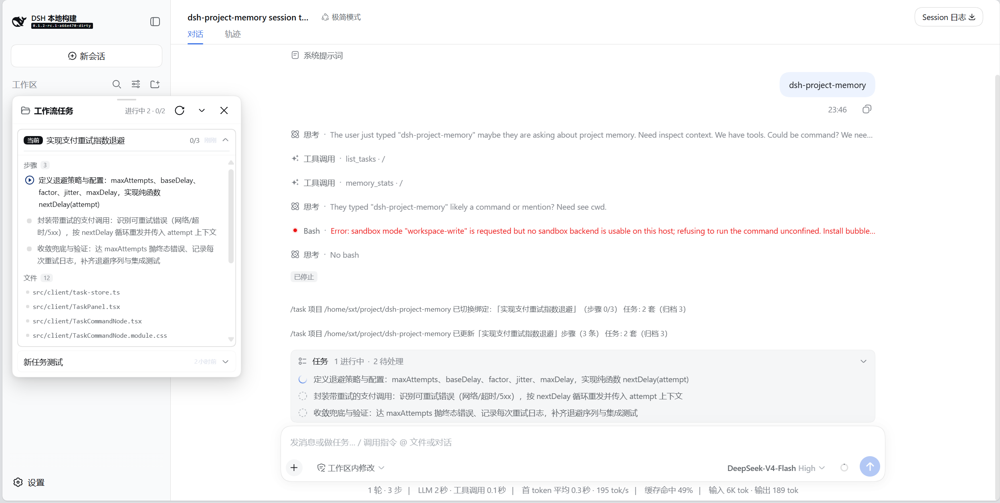

# dsh-project-memory

[English](README.md) | [简体中文](README.zh-CN.md)

[](https://github.com/00080000/dsh-project-memory/actions/workflows/ci.yml) [](LICENSE) [](https://www.npmjs.com/package/@yolk_vat-y/dsh-project-memory) [](https://dsh-plugin.org/plugins/00080000/dsh-project-memory) [](https://awesome-dsh-plugin.com)

为 [DeepSeek Harness](https://github.com/deepseek-ai/deepseek-harness)（dsh）agent 提供持久化的 **项目开发记忆**。专门针对项目开发，原生融合 dsh 任务系统，会话内任务清单与读过的文件自动沉淀为跨会话任务记录，任务↔文件自动关联——开发工作流可切换、可续接，无需重复梳理整个项目，解决上下文失效；文档（PDF/Markdown/txt）与代码符号写入工作区独立存储，文档自动交叉链接至所提及的代码符号；经验笔记（问题 → 方案）自动去重，避免重复踩坑。所有数据按项目落盘，跨会话压缩与交接保留，召回附带 `路径:行号` 可回源核实。单依赖，无向量数据库，无原生构建。


> 插件在磁盘上维护一份精简的项目**记忆**，每条记录指向具体的文件与行号；agent 需要快速了解项目时先查**记忆**，无需重读整个项目。任务与经验跨会话压缩与交接保持。


工作流卡片可收起，自动适应dsh及主题插件风格，提供四种卡片风格切换。


## 特性

- **TaskBridge：跨会话开发任务** — 监听会话内宿主 `todo_write` 维护的任务清单与 `tool/call` 读文件：进度快照（steps）与触碰文件自动同步进跨会话的任务实体。未绑定会话写 todo 时自动建档。新会话通过 `list_tasks` → `select_task`（绑定/改名/解归档）续接；`query_memory` 新增 `type:'task'`，`type:'all'` 结果尾部附任务计数提示。用户侧 `/tasks` 命令展示任务栈、步骤进度、涉及文件与当前会话绑定。标题由模型经 `select_task(title=…)` 命名（回退：取消息最后一个「：」后的任务段）。容量随项目体积自适应（fileCount/20，clamp 5–100）。存储：`.dsh-project-memory/tasks.json` + `binding.json`。自动同步需含会话事件与 `todo_write` 的 dsh（0.1.2-alpha.x 实测）；旧宿主下降级为纯记录。
- **Task Panel（v0.4.2+）：dsh web 浮动任务面板** — 按 dsh web 0.1.2-rc.1 真实 client 插件契约落地（cordis inject + apply，注册进宿主 `shell.overlay` 槽）。卡片可拖拽、展开查看步骤/文件（点击复制路径）；折叠为可拖拽顶部迷你条；可彻底隐藏（输入 `/task` / `/tasks` 唤起）。渲染错误有边界兜底，面板崩溃不再拖垮宿主。
- **任务清单双向同步（宿主 ↔ 插件任务，v0.4.2+）** — `select_task` 或 `/task switch` 绑定任务时，将任务 steps 推给宿主 `todo/write`，dsh 渲染的任务清单跟随我们维护的任务实体。配置 `tasklist.syncHostOnAdopt`（默认开）可关。空 `todo/write` 语义定为「清空」：未绑定会话清空清单不再误建垃圾任务；已绑定则清空该任务 steps（任务保留）。面板编辑（改步骤文本/状态）= 写回绑定任务并推宿主清单，与模型 `todo_write` 共用一套逻辑，无第二套同步。`/task` 新增 `switch` / `archive` / `unbind` / `rename` / `todos`（均由面板按钮/双击调用，不经模型）；`unbind` 同时清掉输入框上方的宿主任务清单。
- **面板编辑与风格（v0.4.2+）** — 绑定卡片：双击标题/步骤行内编辑（输入框随内容自动增高），点步骤状态图标循环 待办→进行中→已完成；非绑定卡片只读。**四档外观风格**（点标题左侧文件夹图标切换，本地记忆）：原生 / 玻璃拟态 / 粗野主义 / 终端等宽——只改材质、几何、字型与密度，颜色始终取自 dsw 别名令牌，跟随宿主明暗与主题插件。
- **文档记忆** — PDF、Markdown、纯文本按块切分并由 LLM 生成摘要，每条记忆携带 `路径:行号` 引用回源文件。
- **代码符号记忆** — 通过零依赖的源码扫描器提取函数、类与方法名及完整类型签名（泛型、参数类型、返回类型、重载签名），包含字符串/注释掩码、多行签名续行、Python 缩进感知、类方法上下文，不使用 LLM token。
- **L1 增强正则** — 零依赖正则扫描器现可提取泛型、参数/返回类型、重载、接口、类型别名，产出单行身份签名 `fn(a: A, b: B): R — file.ts:42`。
- **可选 TypeScript 语义增强 (L2/L3)** — 当用户项目安装了 `typescript`（`npm i -D typescript@5` 或 `npm i -D typescript@6`），插件自动激活第二层（L2），利用 TS Compiler API 推导返回类型、实例化泛型、提取接口与类型别名、丰富箭头函数签名 —— 全部在优先级队列中异步后台处理（P0：`fs/observed` 读文件瞬间、P1：`watch` 变更后、P2：`index_repo` 批量索引）。结果按文件内容哈希缓存到磁盘（L3），冷启动毫秒级复用。零配置：装 TS 再重启 dsh 即可。完全可选；若无 TS 或设置 `enableTypeScript: false`，回退至 L1 正则提取。
- **自动刷新** — `watch_repo` 后台轮询，按内容哈希识别新增或变更文件，仅重记这些文件。
- **读到即记忆** — 文件在模型**实际读取的瞬间**被记忆（监听 `fs/observed`），记忆是正常工作的副产品，而非额外的一次全量扫描。从未读过的文件不会被记忆。项目根通过标记（`.git`、`package.json` 等）、README 加源码目录、或兜底到文件所在目录逐级识别。
- **文档 ↔ 代码交叉链接** — 文档提及某符号时记录为 `reference`；查询符号时同时带出描述该符号的文档。
- **BM25 记忆召回** — 对文档、符号与经验笔记进行排序召回，可选 LLM 查询扩展以应对表述不一致。**CJK 增强**：精确短语乘法加分（3+ 字短语在标题/关键词命中 ×1.5）、同义词表（如 数据库连接池 ↔ 连接池 ↔ DB pool）、CJK 感知的文档↔符号链接边界。
- **blindSpots 感知召回** — 文档摘要携带 `blindSpots` 字段（明确说明摘要未覆盖的内容）。查询命中盲区时，`query_memory` 追加提示引导模型去读原文，防止半截摘要误导。
- **经验笔记** — 记录问题 → 方案；相似问题覆盖而非重复；笔记仅在检索命中时返回。笔记数量有界：容量随项目规模伸缩（钳制在 100–2000），超限时淘汰最旧的笔记。**覆盖阈值收紧为双向 0.7 重叠**（原 0.6）；**经验 `problem` 字段现参与 CJK 短语加分**，提升长尾问句召回。
- **流式 TF + IDF 缓存** — 查询路径按存储版本缓存 IDF（词逆频率）；命中时单次流式遍历 20k 条目仅需 ~8 ms（5k 文件） / ~1 ms（1k 文件），零中间对象；写入路径仅 O(1) 版本号递增。
- **无锁同步事务** — 不采用锁：所有写入（index / watch / remember / forget / watch_repo）统一走同步事务 `store.commit(fn)`，fn 成功后才一次落盘；JS 单线程事件循环保证事务间不交错，`remember`/`forget` 不会被 watch 重索引阻塞排队。多实例并发写入同一项目存储时，得益于 CAS 幂等更新与原子提交，自然具备幂等性，无数据损坏风险。
- **依赖极简** — 纯 JavaScript；唯一运行时依赖是 `pdfjs-dist`（PDF 文本提取），无需原生构建。
- **开销可忽略** — 纯进程内操作；冷启动 <100 ms（5k 文件），典型项目查询中位数 2–3 ms（p99 < 7 ms）；瓶颈在 LLM 摘要与 PDF 解析，插件本身不阻塞。

## 性能

### 合成基准测试（隔离环境，Node 24，Linux）

| 场景 | 规模 | 实测 |
|------|------|------|
| 批量冷记忆构建 | 5,000 文件 / 20k 条目 | 353 ms |
| 冷加载 | 5,000 文件 | 82 ms |
| 热路径懒记忆 | 单文件重记忆+落盘 | 中位数 2.3 ms / 最大 4.0 ms (5k) |
| query_memory (缓存命中) | 5k 文件 / 20k 条目 | 中位数 9.3 ms / p95 12.6 ms |
| query_memory (缓存命中) | 1k 文件 / 4k 条目 | 中位数 1.0 ms / p95 2.0 ms |
| 批量冷记忆构建 | 10,000 文件 / 40k 条目 | 637 ms |
| 冷加载 | 10,000 文件 | 144 ms |
| 热路径懒记忆 | 单文件重记忆+落盘 | 中位数 4.5 ms / 最大 10.2 ms (10k) |

> 合成基准：生成代码（~8 符号/文件），Node 24，Linux 文件系统，SSD。测量纯索引开销，不含 LLM 调用。query_memory 基准使用 IDF 缓存 + 预计算 searchText；写入后首次查询重建 IDF（~150 ms），后续查询命中缓存。

### 真实项目存储体积

| 项目 | 文件数 | 条目数 | 存储体积 | 单条目 |
|------|--------|--------|----------|--------|
| Java Spring Boot 后端 | 1,254 | 7,335 | 6.7 MB | ~0.9 KB |
| Vue 3 + Vite 前端 | 289 | 2,141 | 1.0 MB | ~0.5 KB |

> 真实项目（Java + Vue），测试于 Linux 文件系统（Node 24）。真实项目单条目体积小于合成基准，因符号密度更低、声明行更短。

## 工作原理

设计遵循四个原则：

- **易失性** — 上下文是临时的，会话压缩即丢失。
- **持久性** — **记忆**存于磁盘，跨压缩与会话保留。
- **紧凑性** — 仅存摘要；**记忆**规模约为其覆盖源码的 0.5%（示例项目中 8.8 MB 源码 → 49 KB 索引），**召回**替代了通读整个文件。
- **可核验性** — **召回**在适用时携带 `路径:行号` 引用，agent 可对照源文件核实。

构建**记忆**无需预先全量扫描：文件在模型读取时被记忆，**记忆**恰好覆盖实际处理过的内容。未变更的文件重读是空操作（内容哈希），因此**记忆**的持续维护开销很低。

存储按项目独立存放，并跟随代码库变化：文件变更按内容哈希重新抽取，文件删除则同步移除。经验层仅检索，累积不影响上下文。

## 安装

插件仅依赖通过 peerDependencies 声明的稳定公共 API（`defineTool`、`llm.stream`、`Schema`），保证与后续 rc/alpha 版本无需改动即兼容。

```bash
cd dsh-project-memory && dsh plugin --profile web add . -w
```

`-w`（workspace-root）标志是必需的：profile 目录是 pnpm 工作区根目录，不带该标志 pnpm 会拒绝 add。其他目录下同样可用路径形式：`dsh plugin --profile web add /path/to/dsh-project-memory -w`。

插件同时发布在 npm 上（scoped 包）：

```bash
dsh plugin --profile web add @yolk_vat-y/dsh-project-memory -w
```

每个版本会附带预构建 tarball，无需构建步骤即可安装：

```bash
dsh plugin --profile web add /path/to/dsh-project-memory.tgz
```

每个被索引的项目在 `<root>/.dsh-project-memory/` 下有独立存储。如无需入库，可加入 `.gitignore`。

## 用法

以下工具由 **agent 自动调用**，无需用户手动输入。在对话中直接说自然语言即可——例如「给这个项目建个索引」或「auth 模块是干嘛的」，或者正常开发即可——agent 会自动调用对应工具。默认开启「读到即索引」（`lazyIndexing`）：模型读哪个文件，就顺便索引哪个文件，记忆在你干活的过程中自然积累。`watch_repo` 让显式监听的根目录在后台保持新鲜；`index_repo` 强制对项目做一次全量回填（未变更文件自动跳过）。

| 工具 | 用途 |
|---|---|
| `index_doc file_path` | 索引单个文档（PDF/MD/txt）：分块 → LLM 摘要 → 带 `路径:行号` 入库。未变更文件自动跳过。 |
| `index_repo root` | 索引整个项目：文档由 LLM 生成摘要，代码文件生成零 token 符号表。增量更新、清理已删除文件、文档与符号交叉链接。 |
| `watch_repo root` | 启用自动刷新：后台轮询检测新增/变更文件（mtime + 内容哈希），仅重抽这些文件。监听的项目在插件重启后自动恢复。 |
| `memory_stats root` | 查看记忆库内容：总量（文件 / 条目 / 经验笔记）、最近索引时间，以及按时间排序的逐文件清单。 |
| `query_memory query` | 对文档、符号、经验执行 BM25 检索，可选 LLM 查询扩展。返回带相对分数（0-100）、引用与文档→符号链接的排序结果。 |
| `list_tasks` | 列出本项目任务记录（含归档，带标记）。新会话/续接前先调用。 |
| `select_task` | 将会话绑定到某任务（此后 todo 清单与读文件同步进该任务）。按 `taskId` 精确绑定，或按 `title` 完全匹配（多个同名返回候选；无则新建）。带 title 可改名；自动解归档。 |
| `archive_task` | 归档任务（隐藏默认视图、不占容量、停止同步）。`select_task` 可恢复。 |
| `/tasks`（用户输入，不经模型） | 展示任务栈：标题、步骤进度、涉及文件、当前会话绑定哪套任务。 |
| `/task`（用户输入，不经模型） | 任务面板子命令：`switch` / `archive` / `unbind` / `rename` / `todos`（面板按钮/点击触发，不经模型）。 |
| `remember problem solution` | 保存经验笔记。相似问题覆盖而非重复。 |
| `forget id_or_query` | 删除过期经验笔记。 |

## 设计

```
.dsh-project-memory/
  format.json      布局标记（v2，分片式）
  shards/          每个被索引源文件一个自描述 JSON
                    （{ relPath, record, entries }）——写入只落脏分片
  experience.json  问题 → 方案笔记（仅检索）
  watch.json       被监听根目录
  tasks.json       TaskBridge 任务实体（跨会话）
  binding.json     当前会话 ↔ 任务绑定
```

v0.2.0 之前创建的库（单文件 `entries.json` / `index.json`）在首次加载时自动幂等迁移。同一个 dsh 进程内，所有工具调用共享每个项目的单一内存 store 实例，热路径索引只写发生变化的那一个分片。

- **增量** — 按文件内容哈希，仅重新抽取变更文件。
- **交叉链接** — 索引后将文档摘要与符号名匹配，命中符号以 `references` 挂载到文档条目，由 `query_memory` 带出。
- **查询扩展** — `llmQueryExpansion` 开启时，`query_memory` 让 `ctx.llm` 将查询改写为多个变体（同义词、中英、符号名猜测），再跨变体合并 BM25 分数；关闭时查询完全不碰 LLM。跨语种召回（中文问题命中英文内容）改由索引时承担：文档 keywords 要求同时覆盖文档语言与英文，doc↔symbol 链接也会从中文命中带出英文符号名。
- **一致性** — 事实层跟随代码库（哈希重抽 / 删除即移除）；经验层仅检索，配合覆盖与 `forget` 机制。每个记忆目录的写入走同步事务 `store.commit(fn)`：fn 内完成校验与变更、成功后才原子落盘，单进程内天然串行；请避免多个 dsh 实例同时写同一项目存储。

## 设计取舍

以下是刻意的范围选择。

### 1. 同步无锁事务，而非异步锁

**我们做：** 所有写入走 `store.commit(fn)` 同步事务。回调 `fn` 内完成校验与变更，成功后才原子落盘。JS 事件循环天然串行，CAS (`applyFileUpdate`) 让并发写入幂等。

**不做：** 异步互斥锁、文件锁、多进程协调。

**为什么：** DSH 基于 Cordis，单进程是架构基石。为极少见的多进程场景加锁，会让热路径（每次 `remember`/`forget`/`index_doc`）增重。同步事务让热路径中位数 ~2 ms，零争用开销。

### 2. Watch：事务外计算，事务内提交

**我们做：** 重活（mtime/哈希/扫描/LLM 摘要）在事务外跑，单次 `commit` 原子应用全部变更。失败回滚 snapshot，下轮自动重试。

**不做：** 持锁调用 LLM，或用 `fs.watch` 事件。

**为什么：** LLM 摘要耗时秒级，持锁会阻塞 `remember`/`forget`/`query_memory`。轮询 + mtime+内容哈希跨平台一致（网络盘、Docker 卷、WSL 皆可），避免 `fs.watch` 的「重复触发/漏事件」噩梦。

### 3. 损坏文件隔离，不自动修复

**我们做：** JSON 解析失败时，坏文件改名 `*.corrupt`、记错误、该文件存储重头开始，其余分片不受影响。

**不做：** 预写日志 (WAL)、嵌入式数据库、自动部分恢复。

**为什么：** 一个损坏分片 = 一个源文件索引丢失，隔离成本近零。WAL 或嵌入式 DB 增加 500 KB+ 原生依赖、锁竞争、新故障模式（WAL 自身损坏）。权衡：丢一个文件索引 vs. 引入重型原生栈。

### 4. 查询零向量、零语义搜索

**我们做：** BM25 + CJK 短语加分（3+ 字 ×1.5）、同义词表双向展开、字段加权（标题 ×5）、经验层短语加分。查询侧零 LLM 调用。

**不做：** 向量嵌入、稠密检索、重排序、混合搜索。

**为什么：** 向量需要嵌入模型（本地重、远程慢+贵+隐私）、向量索引（HNSW/IVF 占内存+建索引慢）、重排序（再调一次 LLM）。对代码+文档+经验笔记，增强 BM25 已达 >90% 实战召回。边际收益不抵 10x 复杂度/成本。

### 5. 跨语种召回在索引时完成，而非查询时

**我们做：** 文档 keywords 强制双语（文档语言+英文）；doc↔symbol 链接从中文命中带出英文符号名。`llmQueryExpansion: false` 时查询完全不碰 LLM。

**不做：** 查询时翻译、多语言向量。

**为什么：** 查询时翻译增延迟、耗 token、易翻车（译错=零召回）。索引时双语 keywords 是一次性成本（LLM 摘要时顺手提取），离线确定、可复用。

### 6. 显式 `remember`，不做隐式学习

**我们做：** 用户/显式调用 `remember(problem, solution)`。supersede 用双向 token 重叠 ≥0.7 去重。

**不做：** 从用户纠正中自动抽「教训→规则」、从对话历史推断规则。

**为什么：** 隐式学习不可控——会幻觉、收噪音、污染记忆库且不可审计。显式 `remember` 成本极低（一次工具调用），换来可信、可追溯、用户可控的知识库。

### 7. 直接返回完整条目

**我们做：** `query_memory` 直接返回含 `path:line` 引用的完整条目，每条可回源核实。

**不做：** 先返回极简索引（如 700 字符），再二次调工具取详情。

**为什么：** 完整返回保持 **可核验性**——Agent 能看到每条声明的出处行号。也避免了每次有效命中多一轮工具调用+上下文切换。条目本已紧凑（~300 字摘要+引用），完整返回的 token 成本低于二次调用。

### 8. 符号提取聚焦开发者实际搜索的内容

**我们做：** 正则符号提取（函数/类/方法/接口/类型别名），含字符串/注释掩码、多行签名、跨文件按名链接。对 TypeScript/JavaScript 项目，可选的 L2 增强层利用 TS Compiler API 推导返回类型、实例化泛型、提取接口 —— 全部按内容哈希缓存，毫秒级复用。

**不做：** tree-sitter AST、导入图、调用图、跨文件全程序类型推导。

**为什么：** 正则扫描器零依赖、8 语言、<1 ms/文件，覆盖开发者最常搜索的声明（名字、签名、泛型）。可选 TS 增强层为 TS/JS 提供语义深度，且无原生依赖。按名跨文件链接已覆盖最常见的「找相关代码」场景。全程序分析会引入原生二进制、安装体积增 10x、语言版本即破——边际收益仅在剩余 5% 的边缘情况。

### 9. `forget` 按关键词激进；精确请用 ID

**我们做：** `forget query` 删除所有 token 重叠 ≥0.5 的经验笔记。

**不做：** 交互确认、软删除/回收站、仅精确匹配。

**为什么：** 经验笔记低风险、高量、仅检索。激进删除防止陈旧噪音污染搜索。精确删用 ID（`query_memory` 输出里有）。

### 11. TS 增强可选、异步、缓存

**我们做：** L2 TS Compiler API 在优先级队列异步跑（P0 `fs/observed`、P1 `watch`、P2 `index_repo`），结果按内容哈希缓存 `type-cache/`。零配置——`npm i -D typescript@5` 或 `npm i -D typescript@6` 即用。无 TS 或禁用时优雅回退 L1 正则。

**不做：** 强制 TS、阻塞式增强、全程序类型检查。

**为什么：** 强制 TS 会让非 TS 项目装不上。阻塞增强会卡死大项目 `index_repo`。全程序检查慢 10x、内存重。设计：读到即增强、缓存复用、热路径永不阻塞。

## 配置

| 键 | 默认值 | 含义 |
|---|---|---|
| `memoryDir` | `.dsh-project-memory` | 每个被索引根目录内的存储目录 |
| `chunkChars` | 3000 | 每个文档块最大字符数 |
| `maxChunksPerFile` | 40 | 每文档最大块数 |
| `maxFileSizeMb` | 50 | 大于该值（MB）的文档（含 PDF）/代码文件跳过 |
| `maxOutputChars` | 8000 | `query_memory` 返回文本上限（字符） |
| `tasklist.enabled` | true | 启用 TaskBridge 自动同步（由会话 todo 清单与文件读取沉淀任务实体） |
| `tasklist.syncHostOnAdopt` | true | `select_task`/`/task switch` 绑定任务时，将其 steps 推给宿主 `todo/write`，使 dsh 任务清单镜像任务实体 |
| `maxPdfPages` | 1000 | 未另行限制时 PDF 的页数上限 |
| `llmQueryExpansion` | false | BM25 检索前通过 `ctx.llm` 扩展查询（默认关闭，节省 token） |
| `expansionCount` | 6 | 扩展变体上限 |
| `lazyIndexing` | true | 模型读取文件的瞬间即索引（`fs/observed`） |
| `autoIndexOnFirstUse` | false | 插件加载时对当前工作目录做全量扫描（可选） |
| `watch` | true | 启用后台刷新 |
| `watchInterval` | 15 | 轮询间隔（秒） |
| `tsPath` | (自动) | 可选：强制指定特定 `typescript` 安装路径；省略时按项目 cwd → 插件 node_modules 向上解析 |
| `enableTypeScript` | true | 设为 `false` 彻底禁用 L2 TS 增强（仅保留 L1 正则） |

### 功能开关

两个最常用的开关是 `lazyIndexing`（模型读取文件的瞬间即索引；默认开启）和 `autoIndexOnFirstUse`（插件加载时对当前工作目录做全量扫描；默认关闭）。懒加载建立的索引根会自动注册到 watcher，文件变更无需手动 `watch_repo` 也能保持新鲜。

配置存放在插件的 config 对象中。修改方式：在 profile 的 `cordis.patch.yml` 里加一条覆盖项——web profile 对应 `~/.dsh/profiles/web/cordis.patch.yml`：

```yaml
- id: project-memory
  config:
    lazyIndexing: true          # 开启：模型读到哪个文件就索引哪个（默认）
    autoIndexOnFirstUse: false  # 关闭：不做加载时的全量扫描（默认）
    llmQueryExpansion: false    # 关闭：不用 LLM 扩展查询，节省 token（默认）
    watch: true                 # 开启：被监听根目录后台保持新鲜（默认）
    watchInterval: 15           # 轮询间隔（秒）
    enableTypeScript: true      # 开启：装了 TS 时启用 L2 语义增强（默认）
    # tsPath: /custom/path/to/typescript  # 可选：强制指定 TS 安装路径
```

只需列出要改的键，其余键回落到插件默认值。用 `dsh --profile web --dump-config` 验证生效。

不想改 profile 文件、只想临时试一次，可用 CLI 补丁覆盖：

```bash
dsh web --patch ./config.yml
```

其中 `config.yml` 内容就是上面的覆盖块。

## 开发（面向贡献者）

以下命令用于**维护插件源码**，普通用户无需执行。安装插件只需使用[安装](#安装)一节中的命令。

```bash
npm install
npm test          # 177 项测试（核心 166 + TaskBridge 11）
```

## 许可证

MIT